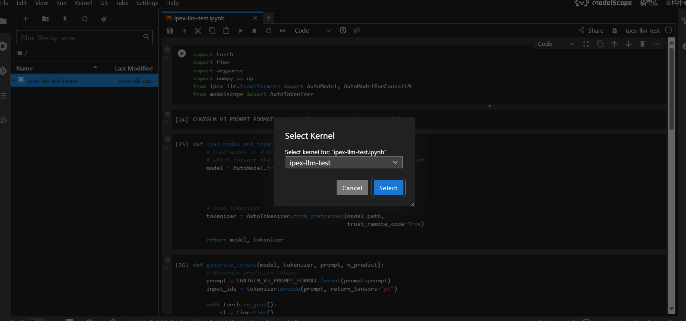

## Modelscope with IPEX-LLM

### Notebook测试环境

#### 创建并启动notebook
1. 进入Modelscope的notebook页面，选择“我的Notebook”——>PAI-DSW——>CPU环境——>启动

2. 选择查看Notebook，等待JupyterLab启动

3. 选择Terminal

#### conda虚拟环境准备
在终端命令行环境中输入下列命令用于在环境目录/opt/conda/envs下
```
cd  /opt/conda/envs 
mkdir ipex-llm-2.1.0b20240410
```
使用gdown下载google drive上的运行环境镜像文件并在云主机的ipex-llm-2.1.0b20240410目录进行运行环境的恢复
```
# 下载文件
pip install gdown
gdown https://drive.google.com/uc?id=1BFxkOKevKt7pSKqdKR0M30pfhwYHYV7q
# 解压文件
tar -zxvf ipex-llm-2.1.0b20240410.tar.gz -C ipex-llm-2.1.0b20240410/
# 激活环境
conda activate ipex-llm-2.1.0b20240410
# 切换至工作路径
cd /mnt/workspace
```
#### 为Jupyter Notebook设置conda虚拟环境
```
# 安装ipykernel依赖
conda install -c anaconda ipykernel
# 把当前conda环境添加为Jupyter Kernel
python -m ipykernel install --name=ipex-llm-test
```
#### 在notebook中使用ipex-llm
下载[示例notebook文件](https://github.com/Jasonzzt/Modelscope-ipex-llm/blob/main/ipex-llm-test.ipynb)，然后上传到modelscope jupyterlab中，并选择内核ipex-llm-test后运行代码，使用其他模型时可以参考[ipex-llm repo中的example](https://github.com/intel-analytics/ipex-llm/tree/main/python/llm/example/CPU/HF-Transformers-AutoModels/Model)修改代码。


### 创空间测试环境
#### 进入创空间页面，使用编程式创建，填写相关信息后发布应用（选择Gradio SDK）

#### 克隆创空间
```
git lfs install
git clone http://oauth2:<your_git_token>@www.modelscope.cn/studios/<user_name>/<space_name>.git
```
#### 创建Gradio的app.py文件
单模型测试参考[ipex-llm-test](https://github.com/Jasonzzt/Modelscope-ipex-llm/blob/main/ipex-llm-test.py)，多模型可选测试参考[ipex-llm-multi-test](https://github.com/Jasonzzt/Modelscope-ipex-llm/blob/main/ipex-llm-multi-test.py).
根据需求可调整README，例如关联模型

#### 提交文件
```
git add .
git commit -m "fisrt commit"
git push
```

#### 启动并上线空间展示
提交文件后，等待5min左右代码审核


审核完成后，进入设置，选择上线空间展示以运行代码，可选设为公开空间。


可以在此查看日志和设置环境变量


#### 可用创空间
- 单模型：https://www.modelscope.cn/studios/Jasonzzt/ipex-llm-test/summary
- 多模型：https://www.modelscope.cn/studios/Jasonzzt/ipex-llm-multi-test/summary