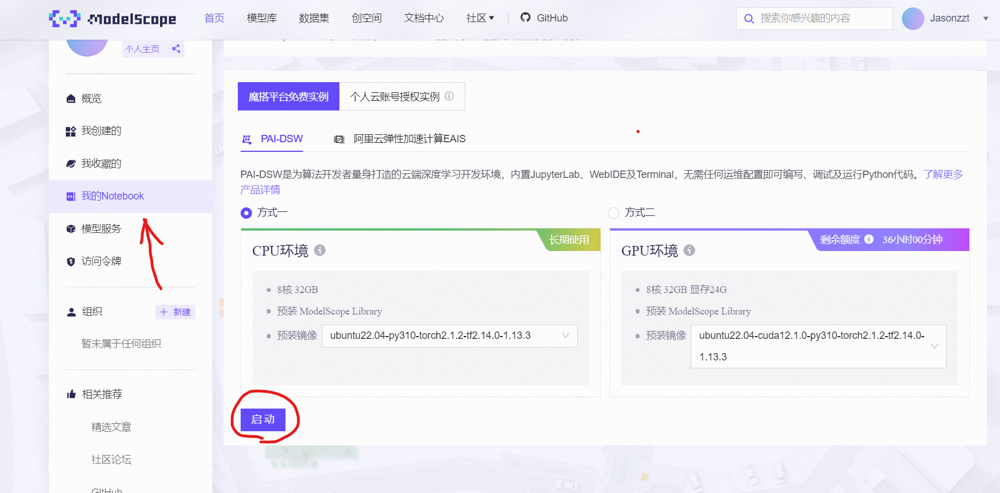
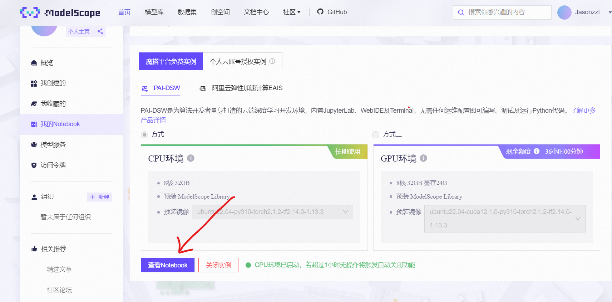
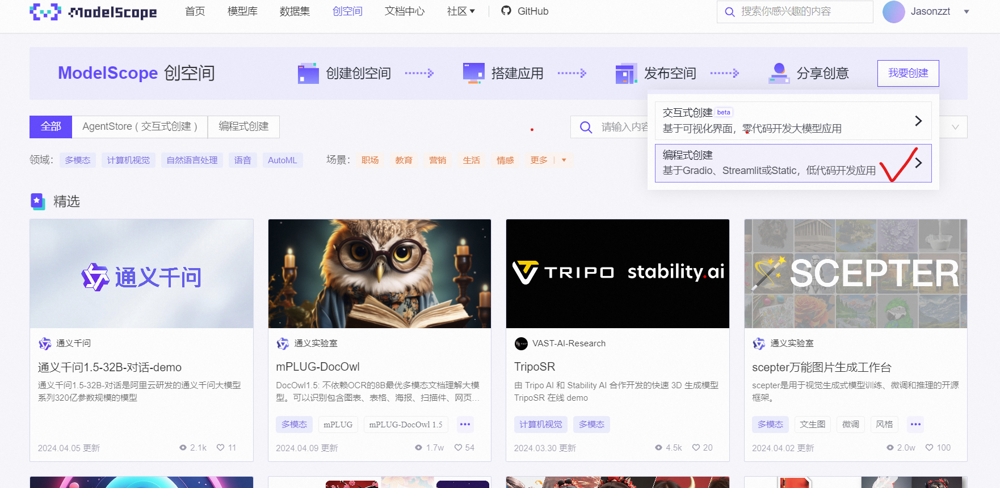
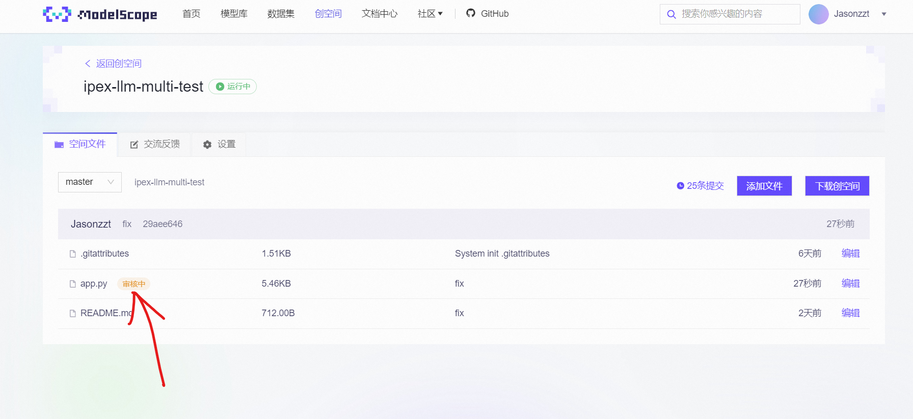
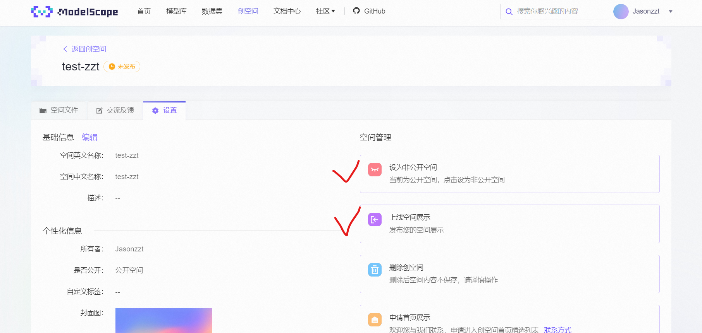
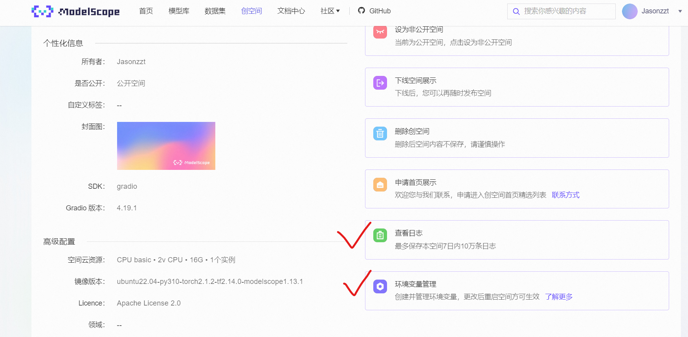

## Modelscope with IPEX-LLM

### Notebook测试环境

#### 创建并启动notebook

1. 进入Modelscope的notebook页面，选择“我的Notebook”——>PAI-DSW——>CPU环境——>启动
   
2. 选择查看Notebook，等待JupyterLab启动
   
3. 选择Terminal
   

#### conda虚拟环境准备

在终端命令行环境中输入下列命令准备conda环境

```
conda create -n llm-sj python=3.11
conda activate llm-sj
pip install --pre --upgrade ipex-llm[all] --extra-index-url https://download.pytorch.org/whl/cpu
pip install gradio 
pip install hf-transfer
pip install transformers_stream_generator einops
pip install tiktoken
pip install transformers==4.37.0

# 安装ipykernel依赖
pip install ipykernel
# 把当前conda环境添加为Jupyter Kernel
python -m ipykernel install --user --name llm-sj --display-name "Python (llm-sj)"
```


#### 准备generate.py脚本


```
import torch
import time
import os
from ipex_llm.transformers import AutoModelForCausalLM
from transformers import AutoTokenizer

model_path = os.path.join(os.getcwd(),"qwen2chat_src")
model = AutoModelForCausalLM.from_pretrained(model_path, load_in_low_bit='sym_int4', trust_remote_code=True)
tokenizer = AutoTokenizer.from_pretrained(model_path, trust_remote_code=True)
model.save_low_bit('qwen2chat_int4')
tokenizer.save_pretrained('qwen2chat_int4')

load_path = "qwen2chat_int4"
model = AutoModelForCausalLM.load_low_bit(load_path, trust_remote_code=True)
tokenizer = AutoTokenizer.from_pretrained(load_path, trust_remote_code=True)


os.environ["BIGDL_OPT_IPEX"] = "true"
QWEN_PROMPT_FORMAT = "<human>{prompt} <bot>"
input_str = "给我讲一个年轻人奋斗创业最终取得成功的故事"
with torch.inference_mode():
    prompt = QWEN_PROMPT_FORMAT.format(prompt=input_str)
    input_ids = tokenizer.encode(prompt, return_tensors="pt")
    st = time.time()
    output = model.generate(input_ids,
                            max_new_tokens=512)
    end = time.time()
    output_str = tokenizer.decode(output[0], skip_special_tokens=True)
    print(f'111Inference time: {end-st} s')
    print('-'*20, 'Prompt', '-'*20)
    print(prompt)
    print('-'*20, 'Output', '-'*20)
    print(output_str)
    st = time.time()
    output = model.generate(input_ids,
                            max_new_tokens=512)
    end = time.time()
    output_str = tokenizer.decode(output[0], skip_special_tokens=True)
    print(f'222Inference time: {end-st} s')
    print('-'*20, 'Prompt', '-'*20)
    print(prompt)
    print('-'*20, 'Output', '-'*20)
    print(output_str)
```

#### 在notebook中使用ipex-llm


```
%%bash
# 在 Bash 中激活 Conda 环境并执行命令
conda run -n llm-sj bash -c '
    source ipex-llm-init -t  # 执行初始化命令
    export OMP_NUM_THREADS=32  # 设置环境变量
    taskset -c 0-31 python /mnt/workspace/generate.py  # 执行 Python 脚本
'
```


### 创空间测试环境

#### 进入创空间页面，使用编程式创建，填写相关信息后发布应用（选择Gradio SDK）



#### 克隆创空间

```
git lfs install
git clone http://oauth2:<your_git_token>@www.modelscope.cn/studios/<user_name>/<space_name>.git
```

#### 创建Gradio的app.py文件

单模型测试参考[ipex-llm-test](https://github.com/Jasonzzt/Modelscope-ipex-llm/blob/main/ipex-llm-test.py)，多模型可选测试参考[ipex-llm-multi-test](https://github.com/Jasonzzt/Modelscope-ipex-llm/blob/main/ipex-llm-multi-test.py).
根据需求可调整README，例如关联模型

#### 提交文件

```
git add .
git commit -m "fisrt commit"
git push
```

#### 启动并上线空间展示

提交文件后，等待5min左右代码审核


审核完成后，进入设置，选择上线空间展示以运行代码，可选设为公开空间。


可以在此查看日志和设置环境变量


#### 可用创空间

- 单模型：https://www.modelscope.cn/studios/Jasonzzt/ipex-llm-test/summary
- 多模型：https://www.modelscope.cn/studios/Jasonzzt/ipex-llm-multi-test/summary
